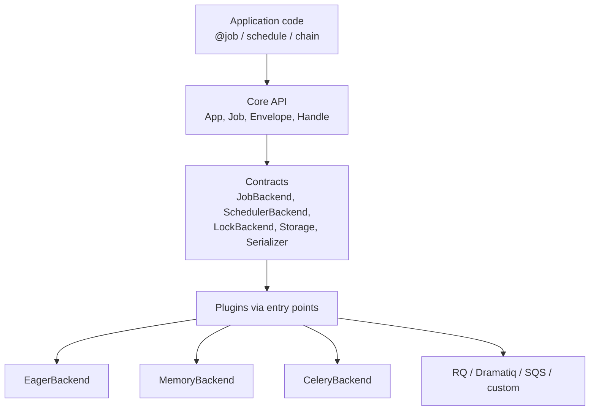

# Architecture

## Philosophy

`PACKAGE_NAME` (`package_name`) provides a **Laravel-inspired** developer experience for jobs, queues, scheduling, retries, locks, failed jobs, pipelines, and monitoring — without coupling application code to Django, FastAPI, Flask, Celery, RQ, or any other framework/engine.

Central promise:

> One stable job API. Swap frameworks and queue backends without rewriting business logic.

The library is an **abstraction and plugin layer**, not a new distributed broker.

## High-level components



## Layering rules

| Layer | May depend on | Must not depend on |
| --- | --- | --- |
| Core | stdlib, click, croniter | Django, Flask, FastAPI, Celery, Redis client (except optional lock adapter behind extras) |
| Contracts | core types | concrete engines |
| Built-in backends | contracts + core | web frameworks |
| Integrations | core + optional framework | each other |
| CLI | core + plugins | frameworks |

Importing `package_name` must succeed with **core dependencies only**.

## Application model

Prefer explicit `App` instances. A process-local default app exists for convenience:

```python
from package_name import App, configure, job

configure(backend="eager")

@job
def send_email(user_id: int) -> None:
    ...

send_email.dispatch(10)
```

Multiple apps in one process are supported for tests and multi-tenant/CLI scenarios.

## Job envelope

Jobs cross process boundaries as a versioned, JSON-safe `JobEnvelope`. Arbitrary Python objects are not serialized by default. Pickle is never the default.

## Capabilities

Backends advertise `BackendCapabilities`. Unsupported operations raise `UnsupportedCapabilityError` instead of silently degrading.

## Configuration precedence

Highest to lowest:

1. Explicit arguments to `App(...)` / `configure(...)`
2. Environment variables (`PACKAGE_*`)
3. Built-in defaults

Framework adapters may translate native settings into the generic config object.

## Security boundaries

- Known-job registry: workers only execute registered job names
- JSON serializer by default
- Redaction hooks for logs, CLI, and failed-job storage
- Trust: queue payloads are treated as untrusted until validated against the registry

See [SECURITY.md](../SECURITY.md) and [docs/security.md](security.md).

## Extensibility

Third-party packages register via `importlib.metadata` entry points:

- `package_name.backends`
- `package_name.schedulers`
- `package_name.serializers`
- `package_name.storage`
- `package_name.locks`
- `package_name.middleware`

See [custom-backends.md](custom-backends.md).
